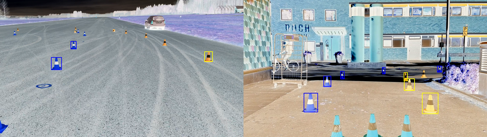
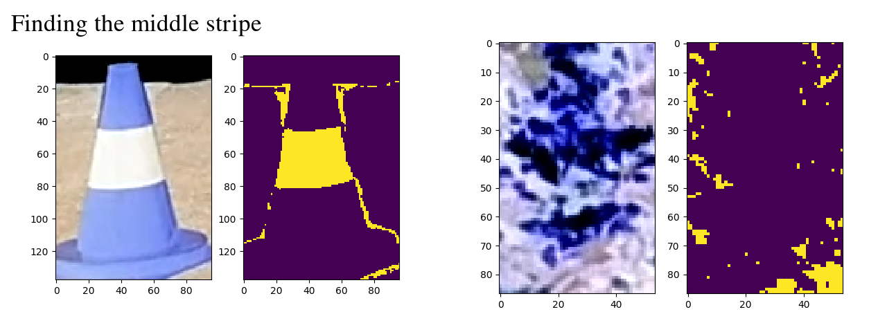

# detection_classic
## Cone detection using classical computer vision

### Method
The detection is done by HSV segmentation on the inverted image. It seems easier to detect blue cones on the inverted image, for a shadowed road is quite blueish.

After HSV segmentation, connected components are found and grouped two by two. A blue cone has indeed one blue cluster for its base, and an other for its top. A bounding box is then created around these two clusters.

To improve robustness, the middle stripe is searched in the center of these bounding boxes, using the same method (HSV segmentation and connected component clustering).
